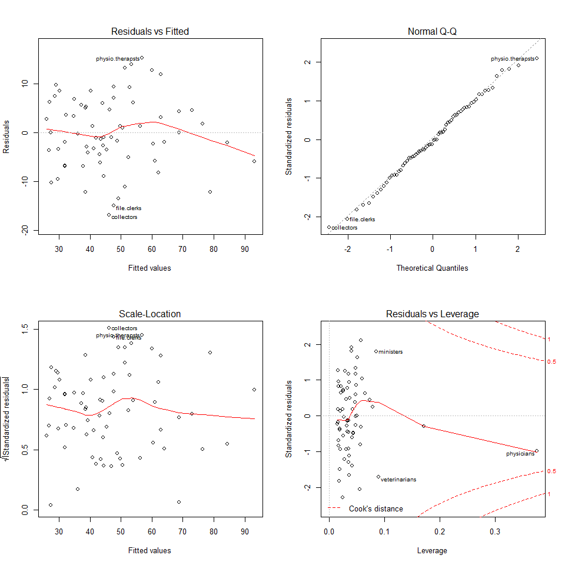
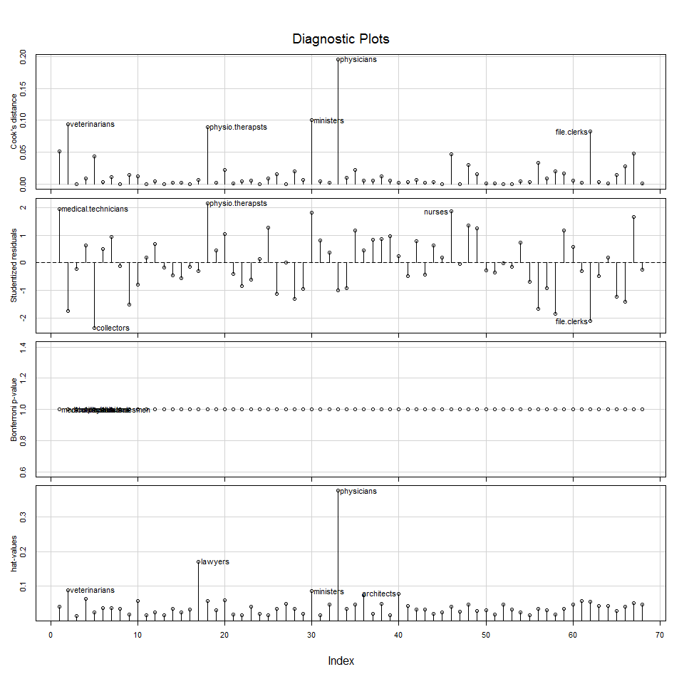
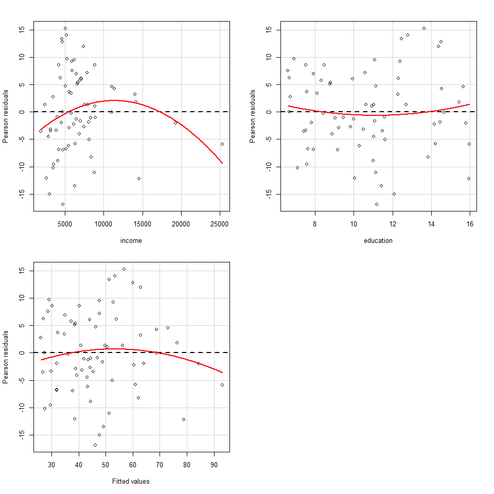
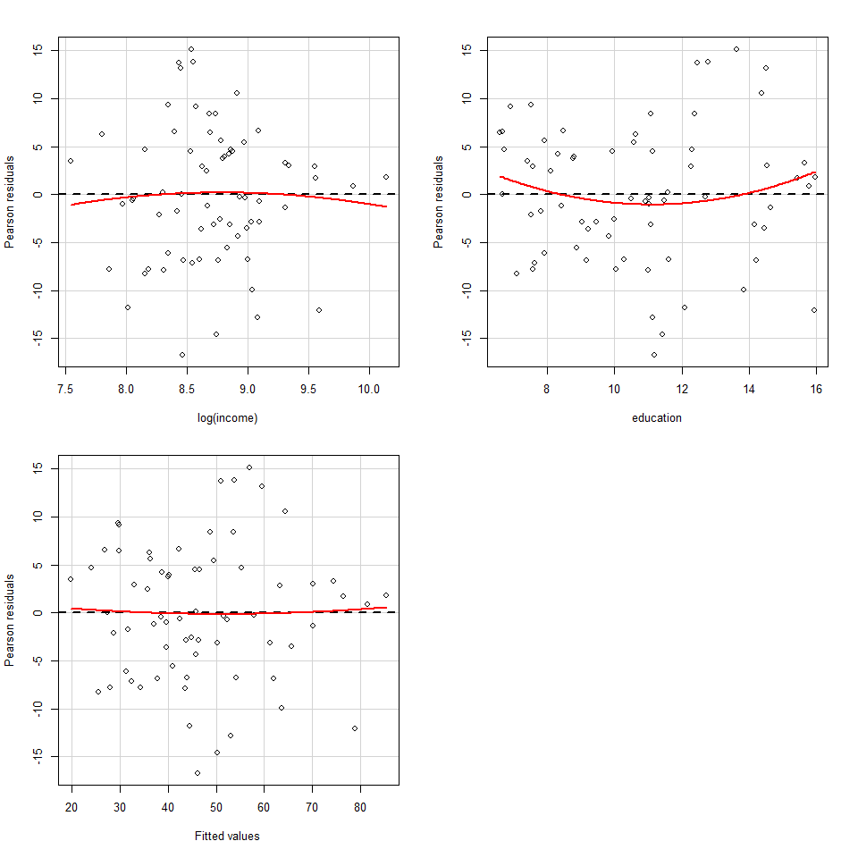
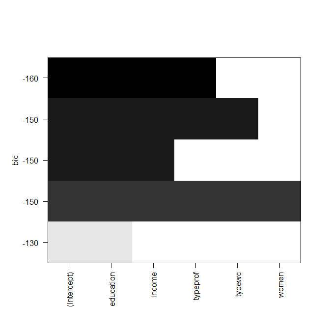
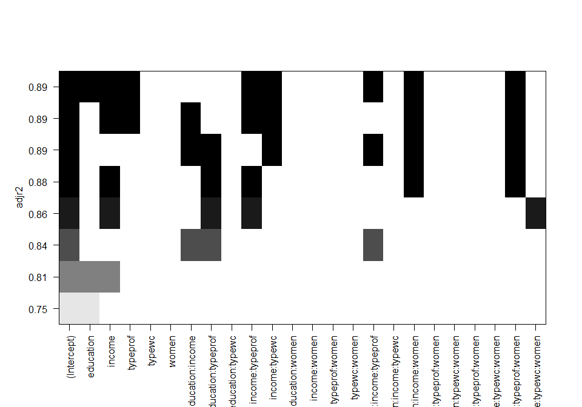
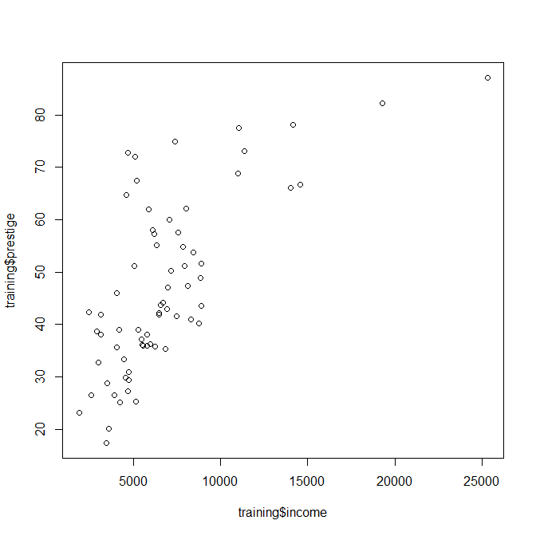
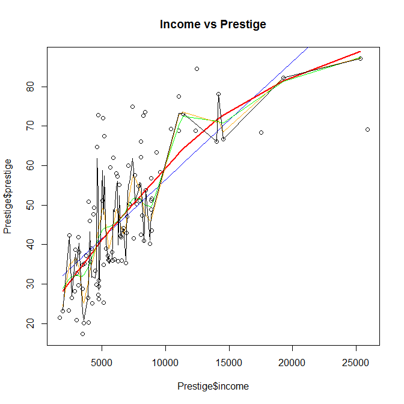

# Regression modelling
Jose Parreno Garcia  
November 2017  
<style>
body {
text-align: justify}
</style>

<br>


```r
library(knitr)
```

In the previous section we learnt a bit of the preparatory steps needed before building predictive models. In this section we will learn about:

* Introduction to linear regression
* Interpreting results and interaction analysis
* Residual Analysis
* Improving models using best subsets, stepwise, and comparing models with ANOVA
* Checking over fitting and cross validation
* Non-linear models with splines and GAM

<br>

# Introduction to linear regression

Linear regression is a widely accepted technique when building models for business because it is an easy technique to explain results and impacts of certain variables.

## Type of variables

From a predictive modelling perspective the variables are of 2 types: dependent and independent.


## The purpose and concept behind linear regression

Linear regression is used when your *y* variable is continuous. 


## Creating training and testing samples

We split the data into training and testing. The training data is the one we use to train the model, then we use the model created to use the test data to check our predictions. 


```r
## LOADING THE DATA FROM THE PACKAGE
# install.packages('car')
require(car)
data(Prestige, package = 'car')
Prestige = na.omit(Prestige)

# In order to separate training and testing set, the first thing we need to do is set a seed. This is done to make sure that the randomiser starts always at the same point.
set.seed(100)

# There are multiple ways of separating a dataset. This uses the sample() function as a method. 70% to the train data and 30% to the test.
train_rows = sample(1:nrow(Prestige), size = 0.7*nrow(Prestige))
training = Prestige[train_rows,]
test = Prestige[-train_rows,]
```

## How to build linear regression models in R

Let's build a first linear model


```r
# For now we have selected a couple of random variables for the first model

lmmod = lm(prestige ~ income + education, data = training)
lmmod
```

```
## 
## Call:
## lm(formula = prestige ~ income + education, data = training)
## 
## Coefficients:
## (Intercept)       income    education  
##   -6.648593     0.001312     4.168073
```

This can be interpreted as


The model we have builts contains an incredible amount of information, you can check it by typing names(lmmod)


```r
names(lmmod)
```

```
##  [1] "coefficients"  "residuals"     "effects"       "rank"          "fitted.values" "assign"        "qr"            "df.residual"   "xlevels"       "call"          "terms"         "model"
```

The most easy way to check the model is by using summary(). We will learn how to interpret the summary() output in the next section.


```r
summary(lmmod)
```

```
## 
## Call:
## lm(formula = prestige ~ income + education, data = training)
## 
## Residuals:
##      Min       1Q   Median       3Q      Max 
## -16.8519  -4.6201  -0.5812   5.4547  15.3010 
## 
## Coefficients:
##               Estimate Std. Error t value            Pr(>|t|)    
## (Intercept) -6.6485929  3.7971583  -1.751              0.0847 .  
## income       0.0013115  0.0002916   4.498 0.00002896860026620 ***
## education    4.1680732  0.4162643  10.013 0.00000000000000846 ***
## ---
## Signif. codes:  0 '***' 0.001 '**' 0.01 '*' 0.05 '.' 0.1 ' ' 1
## 
## Residual standard error: 7.502 on 65 degrees of freedom
## Multiple R-squared:  0.7993,	Adjusted R-squared:  0.7931 
## F-statistic: 129.4 on 2 and 65 DF,  p-value: < 0.00000000000000022
```

## Tyding up results using the broom package


```r
# install.packages('broom')
require(broom)
```

```
## Loading required package: broom
```

```
## Warning: package 'broom' was built under R version 3.4.2
```

```r
# Use the tidy() function from the broom package
lmmod_df = tidy(lmmod)
lmmod_df
```

```
##          term     estimate    std.error statistic                 p.value
## 1 (Intercept) -6.648592860 3.7971582719 -1.750939 0.084674275154143413546
## 2      income  0.001311547 0.0002915664  4.498280 0.000028968600266198165
## 3   education  4.168073239 0.4162643020 10.013045 0.000000000000008459886
```

## How to predict on new data


```r
# To predict use the predict() function
require(broom)

predicted = predict(lmmod, newdata = test)
predicted
```

```
##        gov.administrators          general.managers               accountants       purchasing.officers                  chemists                biologists    vocational.counsellors       university.teachers   primary.school.teachers 
##                  64.19377                  78.39352                  58.73706                  52.57767                  65.30957                  67.07839                  69.37115                  76.28365                  57.52818 
## secondary.school.teachers  osteopaths.chiropractors             nursing.aides               pharmacists               bookkeepers        computer.operators             postal.clerks service.station.attendant                     cooks 
##                  66.74292                  77.61322                  37.31044                  70.42986                  46.23660                  46.37972                  40.22778                  37.84874                  29.69908 
##                bartenders                launderers              farm.workers            slaughterers.2           tool.die.makers       sheet.metal.workers        electronic.workers     sewing.mach.operators        aircraft.repairmen 
##                  33.93441                  27.83803                  31.36876                  31.92897                  45.95604                  36.97353                  35.03385                  23.67769                  45.56885 
##      construction.foremen              longshoremen               bookbinders 
##                  39.34287                  34.47196                  33.73230
```

## Evaluating regression models

Let's compute the accuracy by computing the mean square error (MSE) and the mean absolute percentage error (MAPE). The lower the error the better.


```r
# MSE
mean((test$prestige - predicted)^2)
```

```
## [1] 54.15005
```

```r
# MAPE
mean(abs(test$prestige - predicted)/test$prestige)
```

```
## [1] 0.1571824
```

<br>

# Interpreting results and interaction analysis

In the previous section we learnt how to built a predictive model with only the given variables. However, there might be cases where interactions between variables might be massively valuable. In this section we will learn:

* How to interpret the summary of the lm model
* How to create interaction terms between variables within regression models.

## Interpret results

Let's re-run the summary of the linear model and start de-coding everthing it shows.


```r
summary(lmmod)
```

```
## 
## Call:
## lm(formula = prestige ~ income + education, data = training)
## 
## Residuals:
##      Min       1Q   Median       3Q      Max 
## -16.8519  -4.6201  -0.5812   5.4547  15.3010 
## 
## Coefficients:
##               Estimate Std. Error t value            Pr(>|t|)    
## (Intercept) -6.6485929  3.7971583  -1.751              0.0847 .  
## income       0.0013115  0.0002916   4.498 0.00002896860026620 ***
## education    4.1680732  0.4162643  10.013 0.00000000000000846 ***
## ---
## Signif. codes:  0 '***' 0.001 '**' 0.01 '*' 0.05 '.' 0.1 ' ' 1
## 
## Residual standard error: 7.502 on 65 degrees of freedom
## Multiple R-squared:  0.7993,	Adjusted R-squared:  0.7931 
## F-statistic: 129.4 on 2 and 65 DF,  p-value: < 0.00000000000000022
```

Starting with the coefficients section:

* The $\beta$ values are found in the **Estimate** column.
* The **Std. Error** represents the standard error.
* **t-value** represents the $\beta$ estimate / **Std. Error**
* Finally, based on this **t-value**, the **p-values** (**Pr>|t|**) are derived.

Remember from statistics, that p-values are statistical tests, where we have an initial hypothesis (null hypothesis) and then an alternative hypothesis. The idea is to calculate p-values to determine if we reject or accept the initial hypothesis. As an example, in this case, our null hypothesis would be that there is no relationship between the input independent variable X and the dependent variable Y. In the example above, you can see how significant is each independent variable compared with Y (prestige) variable. Significance levels can vary, but common main practice is that a significance level below 5% is acceptable. This would be represented by the '*'. Aynthing with a star to 3 stars, is a significant variable, which means that we reject the null hypothesis (no relatioship between X and Y) and say there is some kind of relationship between X and Y.


Moving on to the 'metrics' section:

* The **Multiple R-squared** value is the percentage of variation of Y (prestige variable) explained by the model. In general terms, the higher the R-squared the better. * But there is a caveat: as you add more variables to the model, your R-squared will increase, so when you are comparing models, multiple r-squared shouldnt be used as a metric.
* The better way of comparing models is using the **Adjusted R-squared**, because it penalises it penalises the increase in number of predictors.
* A couple of other metrics that are not present in the summary are the **AIC()** (Akaike information criterion) and the **BIC()** (Bayesian information criterion) metric. They are basically penalized-likelihood criteria. The lower the AIC and BIC, the better your model. You can check this in R by using the **AIC()** and **BIC()** function.


```r
AIC(lmmod)
```

```
## [1] 471.9643
```

```r
BIC(lmmod)
```

```
## [1] 480.8424
```

If we have introduced the idea that having simpler models is better by saying that a way to compare different models should be done by checking the adjusted r-squared and not the multiple r-squared, that means there variables that, when added, don't add a huge amount of explanation of the Y behaviour. One of the possible reasons for this is multi-collinearity. As an example, you might a model with only 1 input variable, being that variable significant. However, by adding another input variable, the initial one that was significant, has become insignificant. How is that possible? Basically, that means that both variables kind of explain the same things, and there is no need of having both in the model. This can be checked using the **VIF** (variance inflation factor).


If a variable has high VIF, that means that the information provided by that variable can be explained by other variables in the model. As said above, the presence of a variable with high inflation can be redundant. Typically, a variable with VIF > 4, is said to have multi-collinearity.


```r
car::vif(lmmod)
```

```
##    income education 
##  1.500155  1.500155
```

## Interaction terms

Interaction terms are added when we think a look at 2 variables together rather than on its own might be useful. For example, in a medical insurance world, age and being a smoker will be useful to predict risk, but the combination of both might be even more predicted. In other words, maybe young smokers might be less risky than old smokers. Returning to the dataset we are working with, we might want to investigate the interaction between education and income. If you check the summary results, we can see that the interaction is significant and has improved the adjusted r-squared by 2%.


```r
# The ':' represents product between income and education
lmmod_1 = lm(prestige ~ income + education + income:education, data = training)
summary(lmmod_1)
```

```
## 
## Call:
## lm(formula = prestige ~ income + education + income:education, 
##     data = training)
## 
## Residuals:
##      Min       1Q   Median       3Q      Max 
## -16.6526  -4.9203  -0.5159   4.3688  14.8160 
## 
## Coefficients:
##                     Estimate  Std. Error t value        Pr(>|t|)    
## (Intercept)      -25.0398990   8.4959909  -2.947         0.00447 ** 
## income             0.0045329   0.0013717   3.305         0.00156 ** 
## education          5.4970162   0.6842508   8.034 0.0000000000281 ***
## income:education  -0.0002253   0.0000939  -2.399         0.01934 *  
## ---
## Signif. codes:  0 '***' 0.001 '**' 0.01 '*' 0.05 '.' 0.1 ' ' 1
## 
## Residual standard error: 7.241 on 64 degrees of freedom
## Multiple R-squared:  0.8158,	Adjusted R-squared:  0.8072 
## F-statistic:  94.5 on 3 and 64 DF,  p-value: < 0.00000000000000022
```

## Non-linear terms

We could also specify non-linear terms by making use of the *I()* function in R. Let's say for example that we think there is a relationship of education to the power of 2 that can explain prestige better.


```r
# By adding -1 we can force the model to eliminate the intercept to the created model.
lmmod_1_1 = lm(prestige ~ income + I(education^2) - 1, data = training)
summary(lmmod_1_1)
```

```
## 
## Call:
## lm(formula = prestige ~ income + I(education^2) - 1, data = training)
## 
## Residuals:
##     Min      1Q  Median      3Q     Max 
## -25.929  -2.501   4.125  10.775  16.988 
## 
## Coefficients:
##                 Estimate Std. Error t value             Pr(>|t|)    
## income         0.0017432  0.0003884   4.488            0.0000295 ***
## I(education^2) 0.2646857  0.0223054  11.866 < 0.0000000000000002 ***
## ---
## Signif. codes:  0 '***' 0.001 '**' 0.01 '*' 0.05 '.' 0.1 ' ' 1
## 
## Residual standard error: 10.03 on 66 degrees of freedom
## Multiple R-squared:  0.9604,	Adjusted R-squared:  0.9592 
## F-statistic: 800.4 on 2 and 66 DF,  p-value: < 0.00000000000000022
```

## Factor terms

Finally, we can also include non-continuous variables, in other words, categorical variables to the model. Luckily for use, we don't need to tell the linear model that we are adding a categorical variable. We can simply add it, and it with create dummy variables (i.e., flafs for each category representing an ifelse scenario).


```r
# Categorical variables will show all except 1 of the categories.
lmmod_1_2 = lm(prestige ~ income + education + type, data = training)
summary(lmmod_1_2)
```

```
## 
## Call:
## lm(formula = prestige ~ income + education + type, data = training)
## 
## Residuals:
##      Min       1Q   Median       3Q      Max 
## -12.9067  -5.0913   0.6073   4.6693  18.9229 
## 
## Coefficients:
##               Estimate Std. Error t value  Pr(>|t|)    
## (Intercept) -0.8802776  6.1734227  -0.143   0.88707    
## income       0.0009797  0.0002989   3.278   0.00171 ** 
## education    3.8351980  0.8137227   4.713 0.0000139 ***
## typeprof     5.0908556  4.6935336   1.085   0.28221    
## typewc      -4.6698763  3.0839176  -1.514   0.13496    
## ---
## Signif. codes:  0 '***' 0.001 '**' 0.01 '*' 0.05 '.' 0.1 ' ' 1
## 
## Residual standard error: 6.879 on 63 degrees of freedom
## Multiple R-squared:  0.8364,	Adjusted R-squared:  0.826 
## F-statistic: 80.51 on 4 and 63 DF,  p-value: < 0.00000000000000022
```

## Fitted values and residuals

The fitted values are the predicted by the model for the observations and the training data. It can be computed using:

* the **fitted()** function in R.
* the fitted.values category within the linear model 
* the **predict()** function, which will use the model just created and apply it to the data you want it to be applied to.


```r
## ONLY RUNNING ONE OF THE METHODS (in this case my preferred due to intuition)
# fitted(lmmod)
# lmmod$fitted.values
predict(lmmod, newdata=training)
```

```
##    medical.technicians          veterinarians   real.estate.salesmen             physicists             collectors            bus.drivers                welders            secretaries  commercial.travellers         social.workers 
##               53.45488               78.88400               48.74568               73.00644               46.25187               32.24023               34.85744               46.95278               51.25745               60.88969 
##                 buyers       aircraft.workers            typesetters construction.labourers   rotary.well.drillers           firefighters                lawyers       physio.therapsts         auto.repairmen                 masons 
##               49.75993               38.56789               43.50736               29.82347               39.36111               44.48927               84.34626               56.79896               34.71322               28.67620 
##          mail.carriers     radio.tv.repairmen           receptionsts              policemen     commercial.artists    computer.programers     railway.sectionmen     elevator.operators        shipping.clerks              ministers 
##               39.00898               43.38750               43.17173               50.56941               47.70300               62.04565               27.31148               29.64336               37.81692               59.93438 
##           electricians      textile.labourers             physicians         slaughterers.1        train.engineers                 pilots            draughtsmen        textile.weavers      funeral.directors             architects 
##               44.11400               26.01496               93.06649               31.92897               40.33898               62.89730               53.87692               27.06302               47.72851               76.28190 
##                canners               plumbers    telephone.operators        claim.adjustors    radio.tv.announcers                 nurses           auto.workers             carpenters              surveyors         house.painters 
##               26.75733               37.15786               41.30366               46.36800               56.24554               51.33708               36.10967               29.14436               52.73459               31.87029 
##      sales.supervisors       mining.engineers     electrical.linemen             machinists       insurance.agents           sales.clerks           taxi.drivers          travel.clerks                 bakers        civil.engineers 
##               44.17824               68.82918               41.97930               38.84114               52.36525               38.64270               31.94420               49.20146               30.28587               68.79330 
##             librarians            file.clerks                typists       tellers.cashiers          office.clerks               janitors          psychologists             economists 
##               60.34582               47.69904               45.37132               40.91037               44.54477               27.54010               62.91695               64.09503
```

Residuals are the difference between the real values of the dataset and what your model predicts. You can check it here:


```r
lmmod$residuals
```

```
##    medical.technicians          veterinarians   real.estate.salesmen             physicists             collectors            bus.drivers                welders            secretaries  commercial.travellers         social.workers 
##            14.04512130           -12.18399966            -1.64567784             4.59356107           -16.85187300             3.65977182             6.94256117            -0.95278074           -11.05744728            -5.78969134 
##                 buyers       aircraft.workers            typesetters construction.labourers   rotary.well.drillers           firefighters                lawyers       physio.therapsts         auto.repairmen                 masons 
##             1.34007499             5.13210965            -1.30735796            -3.32346770            -4.06111174            -0.98927364            -2.04625709            15.30103667             3.38678322             7.52379933 
##          mail.carriers     radio.tv.repairmen           receptionsts              policemen     commercial.artists    computer.programers     railway.sectionmen     elevator.operators        shipping.clerks              ministers 
##            -2.90897938            -6.18750182            -4.47173431             1.03058562             9.49700224            -8.24564574            -0.01148160            -9.54336460            -6.91691527            12.86562041 
##           electricians      textile.labourers             physicians         slaughterers.1        train.engineers                 pilots            draughtsmen        textile.weavers      funeral.directors             architects 
##             6.08599729             2.78503701            -5.86649422            -6.72897035             8.56101550             3.20270299             6.12307988             6.23697839             7.17149329             1.81809813 
##                canners               plumbers    telephone.operators        claim.adjustors    radio.tv.announcers                 nurses           auto.workers             carpenters              surveyors         house.painters 
##            -3.55733490             5.74214333            -3.20365779             4.73200093             1.35446157            13.36292122            -0.20966570             9.75563709             9.26541347            -1.97028765 
##      sales.supervisors       mining.engineers     electrical.linemen             machinists       insurance.agents           sales.clerks           taxi.drivers          travel.clerks                 bakers        civil.engineers 
##            -2.67824445            -0.02918486            -1.07929701             5.35886261            -5.06524753           -12.14269680            -6.84420357           -13.50145859             8.61413367             4.30669619 
##             librarians            file.clerks                typists       tellers.cashiers          office.clerks               janitors          psychologists             economists 
##            -2.24582036           -14.99903915            -3.47131945             1.38962589            -8.94476787           -10.24009997            11.98305365            -1.89502865
```

<br>

# Residual Analysis

Given that the idea scenario would be to have all residuals being 0, we want to have a deeper understanding of what the errors look like and how to improve them. In this section we will focus on:

* Residual analysis
* And check extreme/influential values (outliers) with Cook's distance

## Residual analysis plots


```r
par(mfrow=c(2,2))
plot(lmmod)
```

<!-- -->

* **Residuals-vs-fitted.** Remember residuals are the errors and fitted values are the predicted values of the dataset. You can see a dotted line at y = 0, which is what we would like to ideally have the scatter plot points. What we would like is a random cloud of points which would lead to a mean (represented by the red line) falling on top of y = 0 (the dotted line). We don't want the red line to increase or decrease due to the values of the fitted values. If it does we are talking about heteroscasdicity and don't want it to happen or need to address it if we are to obtain good results with the test data. To check this, instead of relying on a visual look at the graph (is the red line massively above dotted line?), we can use a statistical test for it. As always with a statistical test, we have a null and alternative hypothesis. The null hypothesis will be that there is heteroscasdicity and the alternative that there isn't. The test we will perform is the *studentized Breusch-Pagan* using the **bptest()** function from the **lmtest** package. In this case, the results show that the p-value is greater than the significance level of 0.05, we can't reject the null hypothesis that the error is constant and there we can't say there is heteroscasdicity.


```r
# install.packages('lmtest')
require(lmtest)
```

```
## Loading required package: lmtest
```

```
## Warning: package 'lmtest' was built under R version 3.4.3
```

```r
lmtest::bptest(lmmod)
```

```
## 
## 	studentized Breusch-Pagan test
## 
## data:  lmmod
## BP = 10.26, df = 2, p-value = 0.005916
```

* **Normal Q-Q**. The idea is to check that the residuals follow a normal distribution. Ideally, the points should fall in the diagonal dotted line.  

* **Residuals vs Leverage**. Leverage is how much each data point influences the regression. The plot also contours values (you can see a dotted red line with the value of Cook's distance).

## Cook's distance.

Cook's distance shows how much the fitted values would change if an observation was removed. Generally, points that are 4 times bigger than the mean are considered influential. Checking this with diagnostic plots:


```r
cooks.distance(lmmod)
```

```
##    medical.technicians          veterinarians   real.estate.salesmen             physicists             collectors            bus.drivers                welders            secretaries  commercial.travellers         social.workers 
##       0.05121758497251       0.09421145378210       0.00024850345753       0.00924685324075       0.04299623116984       0.00321199903940       0.01124919416023       0.00019992587101       0.01440218682112       0.01267686061983 
##                 buyers       aircraft.workers            typesetters construction.labourers   rotary.well.drillers           firefighters                lawyers       physio.therapsts         auto.repairmen                 masons 
##       0.00017733689784       0.00412907221174       0.00016540976965       0.00250721708718       0.00260060048976       0.00020172796027       0.00618812252024       0.08985199107075       0.00221614114740       0.02240578859158 
##          mail.carriers     radio.tv.repairmen           receptionsts              policemen     commercial.artists    computer.programers     railway.sectionmen     elevator.operators        shipping.clerks              ministers 
##       0.00100276107159       0.00388547982722       0.00530146169568       0.00013338381839       0.00897766744585       0.01563711083389       0.00000004367387       0.02050457282070       0.00603405586864       0.10040344358875 
##           electricians      textile.labourers             physicians         slaughterers.1        train.engineers                 pilots            draughtsmen        textile.weavers      funeral.directors             architects 
##       0.00396283793691       0.00237719988034       0.19609020885535       0.01012482148499       0.02274476557960       0.00517998892517       0.00500503537261       0.01254237723866       0.00532090735127       0.00182032613642 
##                canners               plumbers    telephone.operators        claim.adjustors    radio.tv.announcers                 nurses           auto.workers             carpenters              surveyors         house.painters 
##       0.00362051345123       0.00687563100277       0.00214288564598       0.00300253618780       0.00027525143675       0.04697122622812       0.00000729568786       0.02994785587699       0.01527737398843       0.00078402180011 
##      sales.supervisors       mining.engineers     electrical.linemen             machinists       insurance.agents           sales.clerks           taxi.drivers          travel.clerks                 bakers        civil.engineers 
##       0.00084915006025       0.00000026688106       0.00024309823445       0.00452865900440       0.00265652135019       0.03362028189784       0.00904780715037       0.01981637923678       0.01666161473810       0.00577875292499 
##             librarians            file.clerks                typists       tellers.cashiers          office.clerks               janitors          psychologists             economists 
##       0.00194339904952       0.08232323220865       0.00341642604335       0.00053031001714       0.01410296211552       0.02801145866791       0.04795874418746       0.00113513477365
```


```r
car::influenceIndexPlot(lmmod, id.n = 5)
```

<!-- -->

## Going back to the Residua vs Fitted plot

Given that this is one of the plots I really like to check, it is worth mentioning that the plot you see above is a plot showing is the general information about the model. If you want to see the contribution of each variable you can use the **residualPlots()** function from the **cars** package. 


```r
car::residualPlots(lmmod)
```

<!-- -->

```
##            Test stat Pr(>|t|)
## income        -1.939    0.057
## education      0.743    0.460
## Tukey test    -1.130    0.258
```

If you check the results, we clearly see a significant curvature in *income* compared to *education*. This is the typical example where we would seek to transform the variable. The new model shows that the transformation of the income variable is not flat for the Residuals vs Fitted and the adjusted-rsquared has improved 3%.


```r
lmmod_2 = lm(prestige ~ log(income) + education, data = training)
summary(lmmod_2)
```

```
## 
## Call:
## lm(formula = prestige ~ log(income) + education, data = training)
## 
## Residuals:
##      Min       1Q   Median       3Q      Max 
## -16.7082  -4.6365  -0.2895   4.5747  15.1588 
## 
## Coefficients:
##             Estimate Std. Error t value             Pr(>|t|)    
## (Intercept) -99.2524    17.1611  -5.784 0.000000227309148264 ***
## log(income)  11.7078     2.1849   5.358 0.000001183974299580 ***
## education     4.1309     0.3855  10.715 0.000000000000000531 ***
## ---
## Signif. codes:  0 '***' 0.001 '**' 0.01 '*' 0.05 '.' 0.1 ' ' 1
## 
## Residual standard error: 7.154 on 65 degrees of freedom
## Multiple R-squared:  0.8174,	Adjusted R-squared:  0.8118 
## F-statistic: 145.5 on 2 and 65 DF,  p-value: < 0.00000000000000022
```

```r
car::residualPlots(lmmod_2)
```

<!-- -->

```
##             Test stat Pr(>|t|)
## log(income)    -0.351    0.726
## education       1.256    0.214
## Tukey test      0.184    0.854
```

<br>

# Improving models using best subsets, stepwise, and comparing models with ANOVA

Until now we have learnt how to build a regression model and how to check the basic performance of that model, but we haven't yet looked at building multiple models that might increase performance and how to build them. In this section we will use:

* Best subsets regression
* Stepwise regression
* Comparing models using ANOVA

## Best subsets regression

Best subsets technique chooses the best model for each size based on-predetermined metrics such as adjusted r-squared, BIC, etc. A way to perform best subsets is to use the **regsubsets()** function from the **leaps** package.


```r
# install.packages('leaps')
require(leaps)
```

```
## Loading required package: leaps
```

```
## Warning: package 'leaps' was built under R version 3.4.3
```

```r
regsubsMod = regsubsets(prestige ~ education + income + type + women, data = Prestige)
regsubsMod
```

```
## Subset selection object
## Call: regsubsets.formula(prestige ~ education + income + type + women, 
##     data = Prestige)
## 5 Variables  (and intercept)
##           Forced in Forced out
## education     FALSE      FALSE
## income        FALSE      FALSE
## typeprof      FALSE      FALSE
## typewc        FALSE      FALSE
## women         FALSE      FALSE
## 1 subsets of each size up to 5
## Selection Algorithm: exhaustive
```

```r
plot(regsubsMod, scale = "bic")
```

<!-- -->

How to interpret this chart? We have set the scale to be the BIC metric, and the models will be built to be compared against this. Each rows of the chart represents 1 model, therefore, given the dataset that we use, we see 5 rows. If a model contains a specific variable on the x axis, the row is coloured in black. As we mentioned earlier about BIC, the lower the BIC, the better. In our case, the best model has a BIC of -160 and contains education, income and type == prof. 

This is a great opportunity to analyse all interactions by using the asterisk instead of the plus symbol. In this case, the best model giving the highest adjusted r-squared is represented by the one using income, education, typeof == prof, income x typeof == prof, income x typeof == wc, education x income x typeof == prof, education x income x women, education x income x typeof == prof x women. 


```r
regsubsMod2 = regsubsets(prestige ~ education * income * type * women, data = Prestige)
plot(regsubsMod2, scale = "adjr2")
```

<!-- -->

Let's build that model to check what it looks like. Clearly the model has incredibly improved from the 0.79 adjusted r-squared to the 0.89 showed in the graph above and the summary below.


```r
lmmod_3 = lm(prestige ~ income + 
                                    education +
                                    ifelse(type == 'prof',1,0) +
                                    I(income * ifelse(type == 'prof',1,0)) +
                                    I(income * ifelse(type == 'prof',1,0)) + 
                                    I(education * income * ifelse(type == 'prof',1,0)) +
                                    I(education * income * women) +
                                    I(education * income * ifelse(type == 'prof',1,0) * women)
                         , data = Prestige)
summary(lmmod_3)
```

```
## 
## Call:
## lm(formula = prestige ~ income + education + ifelse(type == "prof", 
##     1, 0) + I(income * ifelse(type == "prof", 1, 0)) + I(income * 
##     ifelse(type == "prof", 1, 0)) + I(education * income * ifelse(type == 
##     "prof", 1, 0)) + I(education * income * women) + I(education * 
##     income * ifelse(type == "prof", 1, 0) * women), data = Prestige)
## 
## Residuals:
##      Min       1Q   Median       3Q      Max 
## -14.7716  -3.0627   0.8038   3.6038  13.0249 
## 
## Coefficients:
##                                                                   Estimate    Std. Error t value         Pr(>|t|)    
## (Intercept)                                                   3.5666107608  4.4150541220   0.808          0.42132    
## income                                                        0.0041292267  0.0004879164   8.463 0.00000000000045 ***
## education                                                     0.8129965651  0.6276364549   1.295          0.19852    
## ifelse(type == "prof", 1, 0)                                 47.7339583077  6.4138305857   7.442 0.00000000005661 ***
## I(income * ifelse(type == "prof", 1, 0))                     -0.0063145843  0.0013305678  -4.746 0.00000777834644 ***
## I(education * income * ifelse(type == "prof", 1, 0))          0.0001961407  0.0000741047   2.647          0.00959 ** 
## I(education * income * women)                                 0.0000041994  0.0000009086   4.622 0.00001265802460 ***
## I(education * income * ifelse(type == "prof", 1, 0) * women) -0.0000047108  0.0000010252  -4.595 0.00001404005195 ***
## ---
## Signif. codes:  0 '***' 0.001 '**' 0.01 '*' 0.05 '.' 0.1 ' ' 1
## 
## Residual standard error: 5.885 on 90 degrees of freedom
## Multiple R-squared:   0.89,	Adjusted R-squared:  0.8815 
## F-statistic: 104.1 on 7 and 90 DF,  p-value: < 0.00000000000000022
```

## Stepwise regression

Another method for searching better models is stepwise regression. Stepwise regression can be of 2 kinds, adding or removing variables one by one. My personal approach has always been towards the removal of variables. Stepwise then uses a defined metric to decide is the model is better or worse than it was with and without that variable (as an example we will use AIC criterion in this case). Unlike best subsets regression, it returns only one best model with the lowest AIC.  To run a step wise model in both directions we need to:

* First define a base model that doesn't include variables, and then one which includes all of them.
* Then we use the step function specifying the base model, scope and direction.
* The model with the least AIC is shown at the end.


```r
training1 = na.omit(training)

base.mod = lm(prestige ~ 1, data = training1)
all.mod = lm(prestige ~ ., data = training1)


stepMod = step(base.mod
               , scope = list(lower = base.mod, upper = all.mod)
               , direction = "both"
               , trace = 1, steps = 1000)
```

```
## Start:  AIC=382.18
## prestige ~ 1
## 
##             Df Sum of Sq     RSS    AIC
## + education  1   13424.8  4796.6 293.42
## + type       2   12148.9  6072.5 311.46
## + income     1    8921.3  9300.0 338.44
## + census     1    7303.9 10917.5 349.35
## <none>                   18221.4 382.18
## + women      1      82.2 18139.2 383.87
## 
## Step:  AIC=293.42
## prestige ~ education
## 
##             Df Sum of Sq     RSS    AIC
## + type       2    1306.6  3489.9 275.79
## + income     1    1138.7  3657.9 276.99
## + women      1     832.0  3964.5 282.46
## + census     1     558.2  4238.4 287.01
## <none>                    4796.6 293.42
## - education  1   13424.8 18221.4 382.18
## 
## Step:  AIC=275.79
## prestige ~ education + type
## 
##             Df Sum of Sq    RSS    AIC
## + income     1    508.42 2981.5 267.09
## + women      1    192.19 3297.7 273.94
## + census     1    133.72 3356.2 275.14
## <none>                   3489.9 275.79
## - type       2   1306.65 4796.6 293.42
## - education  1   2582.54 6072.5 311.46
## 
## Step:  AIC=267.09
## prestige ~ education + type + income
## 
##             Df Sum of Sq    RSS    AIC
## <none>                   2981.5 267.09
## + census     1     13.48 2968.0 268.78
## + women      1      0.59 2980.9 269.07
## - income     1    508.42 3489.9 275.79
## - type       2    676.37 3657.9 276.99
## - education  1   1051.28 4032.8 285.62
```

```r
stepMod
```

```
## 
## Call:
## lm(formula = prestige ~ education + type + income, data = training1)
## 
## Coefficients:
## (Intercept)    education     typeprof       typewc       income  
##  -0.8802776    3.8351980    5.0908556   -4.6698763    0.0009797
```

## Comparing models using ANOVA

ANOVA lets you check if one model is a sufficient fit compared to a superset model. You have to make sure that the models passed to ANOVA are nested, that is, the predictors in one model is a subset of the next one.

ANOVA checks if the model is significant compared to the previous one. As an example, here model 2 is massively significant compared to the first one. The 3rd model is has still got a significant effect compared to the second model, which basically shows that model 4 is not interesting meaning that the *women* variable is not needed in the model. 


```r
mod1 = lm(prestige ~ education, data = training1)
mod2 = lm(prestige ~ education + income, data = training1)
mod3 = lm(prestige ~ education + income + type, data = training1)
mod4 = lm(prestige ~ education + income + type + women, data = training1)
anova(mod1,mod2,mod3,mod4)
```

```
## Analysis of Variance Table
## 
## Model 1: prestige ~ education
## Model 2: prestige ~ education + income
## Model 3: prestige ~ education + income + type
## Model 4: prestige ~ education + income + type + women
##   Res.Df    RSS Df Sum of Sq       F      Pr(>F)    
## 1     66 4796.6                                     
## 2     65 3657.9  1   1138.70 23.6838 0.000008151 ***
## 3     63 2981.5  2    676.37  7.0339    0.001766 ** 
## 4     62 2980.9  1      0.59  0.0122    0.912283    
## ---
## Signif. codes:  0 '***' 0.001 '**' 0.01 '*' 0.05 '.' 0.1 ' ' 1
```

<br>

# Checking over fitting and cross validation

In the previous section we learnt some interesting techniques to select the best model. The next step is to cross validate the model rigorously to see how accurately it will perform in practice. The K-fold cross validation is a convenient way to test this. In this section we will learn:

* How k-Fold cross validation works
* How to implement it in R

## How k-Fold cross validation works

Cross validation is the process of building a model on a dataset and then testing it on a different sample. The k-Fold cross validation performs the validation process *k* times by splittting the data into *k* samples. For example. if *k=5*, then we would build the model on four samples of the data, and then test on the fifth unused sample. Then we would change the unused sample data, including the previous one in the training model, and repeat the process. At the end, when the *k* tests have been performed, the mean of the errors if finally reported. 

## How to implement it in R

The **cv.glm()** function in the **boot()** package can implement the coupled cross-validation. In order to use this, we ned to build the linear model using the **glm()** function instead of the **lm()** function, and then apply the **cv.glm()**. The *$delta* parameter in cv.glm() provides the MSE and adjusted MSE across the k-Folds of cross validation. 


```r
#
require(boot)

Prestige = na.omit(Prestige)

glmmod = glm(prestige ~ income + education + type, data = Prestige)
cv.glm(Prestige, glmmod, K=5)
```

```
## $call
## cv.glm(data = Prestige, glmfit = glmmod, K = 5)
## 
## $K
## [1] 5
## 
## $delta
## [1] 53.50677 52.82618
## 
## $seed
##   [1]         403          68   592439882 -1454903371 -1649372401 -1969344490 -1989559616  -612148093    68905121  2042642064   979664238    39209753  -213545045   946924954  -397010596  1225142367   359792693 -1344875572   432166690   503409021
##  [21]   272794231  1261697950  2108631640   549389243   419317081  -234184984 -2137153770   575156369  -293368509   571201618  1480256228   542944551   690812285   756898932   856016474  1007026853   282413247   -68650170   996952528  -584295437
##  [41]  1669071633  1916572480  1519205150   466846697 -1378481893  1573626666 -1347492788  1298721807 -2086942907   735965436  1759756114  -934530867 -1639169913  2018747246 -1981590200   718659915  2030556329  1580443128  2023591206  1003646529
##  [61]  1328900051  -949207678  -366587468   392625463  -461850579   260154692   -24862102  -991834923   310545007   707772278 -2115895136  -669542045  1246583297 -1569339024  1153399054  -852440199    25314059 -1872868294   511863612   652034175
##  [81] -1468537899   457706988  1160224578   391159965 -1666770665 -1070960514  1067894840  1123802907   167062649  2009150664 -1065134858 -2144320207  1703212387  1824200498 -1477427068   894377159 -1457746019  -951928044 -1775318598  -255991803
## [101]  1335367135  1421338726  1769232368    47882515  1017642673  2022521184  -619540738 -1805325687  -417102405  1956347786  1209919084  -802629649   250114085  1067909340 -1959827790  1069582765  1925283175  1858415246   614151016  -774247573
## [121]  1019598089  -412243048 -1395250490  -380039135  1436013747  1139459618  -577898476 -1948287849  1744098957 -1472219228   351644042  1202918901   981796943  -306929834  1878095360 -2009413821  1081450209  -912262064 -1169374034 -1855037351
## [141]  -796458901   443430362   765304476  -499666785  1433225973  1805473676 -1587513758  1102105149 -1916898121   764717918 -1082683752   408382971   988032921 -1648621528 -1749487402 -1916291759   -78191613  -484111470   644311332  -351916057
## [161]  -538627011  -679148876   839094554  1405149797  1138968319  2145401734   666475792  -300935757  1501349457 -2072205824  -593370402   -15273687 -1451107109  -591598614 -1756120180  1490713807 -1051253627   171700028  1947725330 -1837208307
## [181]   157726279 -1202492370 -1828851320  1417881739 -1745010071  -693092808  -960276762   687731329  1823571475  -864810558     4366964  1998374007   -27292307  -417549820 -1906142934  1294976661 -1382896337  1843304502  -487478176 -1282194781
## [201]   -11438655 -1966095952   835952846   775831097  -189628341  1497838074    90795260 -1908211393   849739285  1946631468 -1655075326  1973785821 -1578070057 -1683035458 -1523389192  -489598245 -1135867591   288246920   301906998  -691402639
## [221] -1189758301 -1031692302    65942340  -699163641  1041676765 -1781463340   -51860998  2019591493  -691056225  1474233916  1355417364 -1250665790  1043628768  -831984516  1186852048   432634786     -266712    34900236  -127903812  -416720590
## [241] -1713454912  -660114892 -1893610808  1017031354   929215632  1265604332 -1899987372   733677202  -447789280  1700755404  -210190112  2088763074   621229096  -703292500   -17777988 -1835824654  -691874256  1638414244 -1807519304  1370325850
## [261]   -54037360   698329980  -145430764  1322175810   624291584  1179636668   451071824  2055080226 -2140282296   486707212  -971582372  -656723502 -1534935552 -1211260588 -2089234200 -1973133062  -702003504   370135340  1110073588  -867168878
## [281] -1661740704  -190064628   -61553952  2015079010  -768097624   559409740 -1218056324   514889010  1444767344 -1880722620 -1845729320   -99088518  -368134608 -1055004740   569882196   768593986  -879398752 -1215383876   292973008  1991754594
## [301]   480551656  1348583628   733209084  1383723506  1925909120   669294068 -1760151928 -1282810054  -757247152    80866412 -2026274412 -1782107054  1219953120   257645772 -1419262816  1456534914 -1718236952 -1856932116   170022204  1657474162
## [321] -1770854288 -1518010332 -1064612808  -829608166   721513680   -23609540  1471932308   670978946 -1670821440  1371340348 -2000075376  2015378978 -1484118776  -937906548  1851760412  -236470126  -633030272   393569812  1015848744   853285434
## [341] -1345045040  -522671764 -1139440716  1913673746  -602180128  1348487116  1849549024   279713826    53109032  -258335220   204416828   812499954  -380527888  -342634940  1200898648   613732154  1607394800  1708349116 -1998735084    32981698
## [361]  1181217888  1876034428  1340741584  1342234914  1975548584 -1326376052   367311036  -126488782 -1821595072   642677940  1718559304  2038654394  -253492720 -1031998740 -1918426796  -792379118 -1483453024 -1084644660 -1462624672   105936834
## [381]   435611432 -1151570004   980017980  -951670414  1077967664   994077988  1702669112 -1728241958  1575135120   940461820 -1415009388   597565506 -1346939648   433095740  1585758544  1056116898  1316512072  -972810484   472761052  -711824046
## [401]   149308544 -1589206956 -1124364312  -685725446  -814765232   394755884   672442740  1124920210   983443552 -1384362612  -520594592 -1641268766  1948808104 -1954270004  -709165060   850388402  1568044528  1236863940 -1044339368 -1873127046
## [421]  1150485424  -185038404 -1927530412 -1476315198  -467128288  -109823812   234394192 -1980517406   424411240  1186841676 -1808426756 -1291842574  -964376320  1324433780  1744825352  1975091130 -1961414192  -500794388  -498196076  -648408622
## [441]   705532256 -1328492724  1581472032 -1883160702 -1565413656   215924972  2046276668  -542852238   556678768   115741732  1471957816   660843674   650384080 -1558249284  -145150316 -2012236158  -578470438   632221592  1716895233   776916915
## [461]  1649442516  1837025250 -1620252041  -157248575   -91385530 -1750515580  1867286069 -1426600417   489617784  -801671082  -615836445  1747272357 -1204617406  -755294928  -263381671 -1694708021  -689526980  -513593494   -26894945  1398060073
## [481]  1900193470  -230111316  1086246141 -2039269305  -290486480  -116268978  -958698373  -623493155  -680645110 -1465388248  -701743727   148341635  -183375740    45254322 -1231349241 -2064160175  -724868650 -1174074188  1996748997  -798258673
## [501]    79127176 -1007151194   736124755  -312074059  -798523886  1666391008  1640181321  -958157701   127421772 -1951303462  -961148721  -509225831 -1257105234  -501398084 -1162584531   387267031  1993986080   -97864322   894413643  -241274547
## [521]   748375930  1156293048 -2006629535  -432909549  1104980788  1656203586 -1505759913  1583286433  -601923226  1415025508 -1121437035  1046739903  -702263464  -520354442  1974265731  -585843259  -910179614 -1380848816   732100217   483981739
## [541]  -742174948  -615638966 -1048605633 -1821569911   668395678    60220748  -657111779 -1414102873   620523472 -1170528402   931843611   776615805   187841898  1399854088  -658891599  -922928349 -1087584220 -2113221934 -1123377369  -209665679
## [561]  1876690870   788101972  1265305061 -1158610961  -803021016  1408395142  -667987021 -1978485995   500518258 -1908297280 -1385651671   -91920741  -832229524  1554626426 -1452126033  1815735225   315817422  1173858588  -962323315  -379350793
## [581]  1308630016  1218387550  -967409365  1887691309  -316054886   -63758760  -266788415   185708147  -759780460  1340842530 -2071614153  2022984705     2552070   740529476  1857042549 -1371825697   -11229896  1090795286 -1229441245 -1129036571
## [601]  1839988994 -1536167056  1936583449  -906851573  1096800252  -469552086 -1816766369    26775529   908620030   372875500   231326781  1742551047  -624475152  1366232974   373001659   910388125  -755175094 -1965516440  -688058543  -961573821
## [621]  -974564028   313325042  -595853369  1142669713  1590129942   227162105
```

<br>

# Non-linear models with splines and GAM

So far we have been building models where the fit has always been a straight line. It is time we learn how to build non-linear models as well. In this section we will learn:

* How to fit smoothing curves instead of lines of best fit using smooth.spline()
* Then we learn how to create multiple variables from one variable in the form of natural cubic splines
* And how to use it as exploratory varaibles in GAMs.

## Smoothing curves with smooth.spline()

Smoothing splines is a great way to capture non linear relationships between the y and the x variable. Let's work this with an example. The relationship between prestige and income is linear to a certain point but flattens after certain level.


```r
plot(x = training$income, y = training$prestige)
```

<!-- -->

Let's model the smoothing splines for various degrees of freedom. The *df* argument in the *smooth.spline()* function sets the degree of freedom, and then *cv = T*, does a cross-validation to find the optimal degrees of freedom. The sp_cv seems to say that the optimal number of degrees of freedonm is 4, let's check that with some plots. As you can see, the more degrees of freedom you allow, the more curvature and overfitty the models get.      


```r
sp_cv = smooth.spline(x = training$income, y = training$prestige, cv =T)
sp_cv
```

```
## Call:
## smooth.spline(x = training$income, y = training$prestige, cv = T)
## 
## Smoothing Parameter  spar= 1.072092  lambda= 0.005693696 (14 iterations)
## Equivalent Degrees of Freedom (Df): 4.039708
## Penalized Criterion (RSS): 8765.979
## PRESS(l.o.o. CV): 854.1636
```

```r
sp2 = smooth.spline(x = training$income, y = training$prestige, df = 2)
sp4 = smooth.spline(x = training$income, y = training$prestige, df = 4)
sp10 = smooth.spline(x = training$income, y = training$prestige, df = 10)
sp20 = smooth.spline(x = training$income, y = training$prestige, df = 20)
sp50 = smooth.spline(x = training$income, y = training$prestige, df = 50)

plot(x = Prestige$income, y = Prestige$prestige, main = "Income vs Prestige")
lines(sp2, col = "blue")
lines(sp4, col = "red", lwd = 2)
lines(sp10, col = "green")
lines(sp20, col = "orange")
lines(sp50, col = "black")
```

<!-- -->

Now, that we have checked that a model with 4 degrees of freedom using splines seems to be the most optimal, let's use it to predict test data. We can see that we have a mean squared error of 118 and a rmse of 10.88 (when Prestige has a range of ~60) so that is not that bad considering that only 1 predictor was used. 


```r
# install.packages('DMwR')
require(DMwR)
```

```
## Loading required package: DMwR
```

```
## Warning: package 'DMwR' was built under R version 3.4.3
```

```
## 
## Attaching package: 'DMwR'
```

```
## The following object is masked from 'package:broom':
## 
##     bootstrap
```

```
## The following object is masked from 'package:plyr':
## 
##     join
```

```r
predicted = predict(sp_cv, test$income)$y
DMwR::regr.eval(test$prestige, predicted)
```

```
##         mae         mse        rmse        mape 
##   8.8769458 118.4485612  10.8834076   0.2088256
```

## Splines and GAMs (generalized additive models)

The **splines()** package provides a couple of useful ways to produce new variables that could be used as exploratory variables in GAMs or linear models. For example the natural splines (**ns()** function) with 3 degrees of freedom gives 3 columns, which we can use to build generalized additive models. 


```r
require(splines)
```

```
## Loading required package: splines
```

```r
head(ns(Prestige$income, df = 3))
```

```
##               1         2          3
## [1,]  0.3993951 0.4373723 -0.1004036
## [2,] -0.1655583 0.3563004  0.8092579
## [3,]  0.2256924 0.5364234 -0.2499320
## [4,]  0.1897076 0.5529689 -0.2671500
## [5,]  0.1447406 0.5728679 -0.2859775
## [6,]  0.3453951 0.4743901 -0.1684402
```

GAMs allow us to model the Y variable as an additive combination of non-linear functions of x, so that basically, instead of x we can use nonlinear functions of x. It is called additive because it calculates functions for each x and adds up their contributions. LEt's use the **MGCV** package for this. We have an much better performance if you look at the results.


```r
gamMod = mgcv::gam(prestige ~ ns(income,3) + ns(education,4) + type, data = training)
gamMod
```

```
## 
## Family: gaussian 
## Link function: identity 
## 
## Formula:
## prestige ~ ns(income, 3) + ns(education, 4) + type
## Total model degrees of freedom 10 
## 
## GCV score: 52.34257
```

```r
predicted = predict(gamMod, test)

DMwR::regr.eval(test$prestige, predicted)
```

```
##        mae        mse       rmse       mape 
##  5.6301073 50.4088997  7.0999225  0.1408808
```


